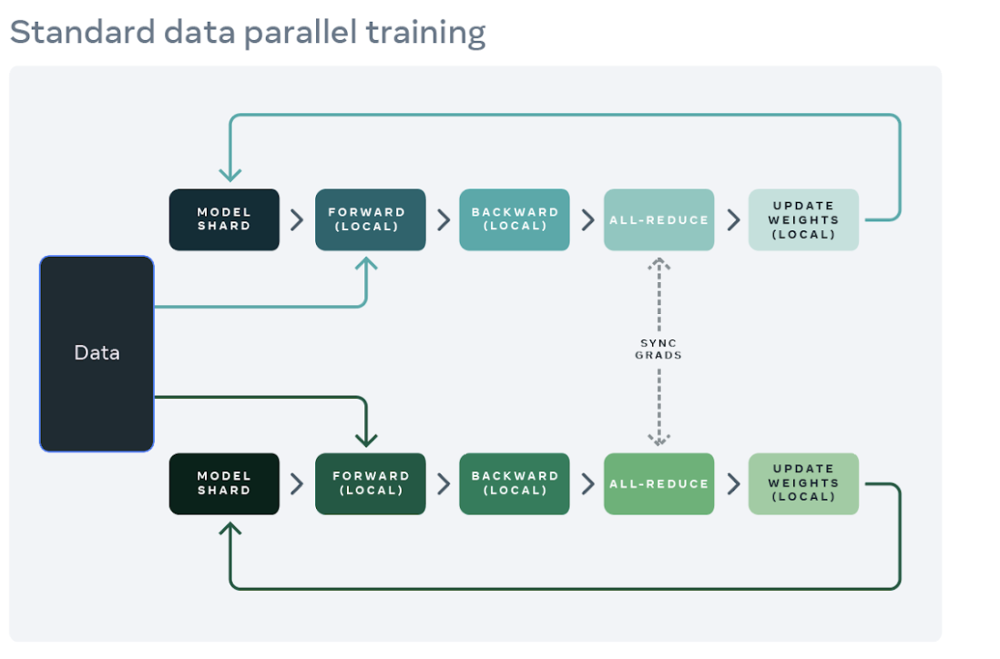

Neural network models are getting bigger and bigger. To keep up with this trend, it's important to be able to scale the hardware that we use to train these models. One way to do this is to use multiple accelerators, such as GPUs or TPUs. There are several different ways to train a model on multiple accelerators. Data parallelism and model parallelism are the two main categories of parallelism techniques, and each specialized technique falls under one of these categories.

> This post is intended to provide a basic understanding of data and model parallelism. For a more in-depth treatment of these topics, please refer to Lillian Weng's excellent [article](https://lilianweng.github.io/posts/2021-09-25-train-large/).

## Data Parallelism

Data Parallelism is a technique to speed up the training process by sharding the data across multiple devices. The model is copied across several devices and each device receives a separate mini-batch of data. After the gradients are computed during backpropagation, all devices receive gradients from every other device. This global synchronization of gradients occurs once every n iterations where `n >= 1`. Every device sums all the gradients together and updates its local copy of weights. This summation is technically referred to as the `AllReduce` operation. A higher value of `n`  means that the gradients are synchronized less often which often leads to a faster training process but it can also lead to staleness of the model parameters.

											Fig 1: Data Parallel Training Process. (Image [Source](https://engineering.fb.com/2021/07/15/open-source/fsdp/))

At the end of the training process, the weights from each device are aggregated to create a global model.

A major drawback of Data Parallelism is that it is memory inefficient as each device stores a copy of the entire model.

## Model Parallelism 

Model parallelism is a technique used to train machine learning models that are too large to fit on a single device. Model parameters are sharded across multiple devices and each device is responsible for the computation of that particular shard. Compared to Data Parallelism, memory footprint and computation workload of each device is lower. However, there is a significant increase in communication overhead as activations need to be communicated across devices. 

### Pipeline Parallelism

Neural Networks consists of layers built on top of another which makes their sharding process trivial. However, if a system of these devices trains a network in a sequential manner it can lead to long idle times for some devices. Pipeline Parallelism can significantly reduces per device idle time and it follows the same principles as [instruction pipelining](https://en.wikipedia.org/wiki/Instruction_pipelining) in a single processor.
Each device stores a layer (or more) and processes a different micro-batch of data in parallel. Every micro-batch of data undergoes both the forward and backward passes through each device. The number of workers that the model is split over is commonly known as pipeline depth.

Gradients can be aggregated either in a synchronous or an asynchronous manner at the end.
In [GPipe](https://ai.googleblog.com/2019/03/introducing-gpipe-open-source-library.html), gradients are aggregated and applied synchronously for each micro-batch of data at the end.

 
								Fig 2: Naive MP vs GPipe (Image [source](https://ai.googleblog.com/2019/03/introducing-gpipe-open-source-library.html))

[PipeDream](https://www.pdl.cmu.edu/PDL-FTP/BigLearning/sosp19-final271.pdf) is an example of asynchronous gradient accumulation and aims to reduce the bubble time highlighted in the above image. It does so by alternating between the forward and backward passes for each worker after an initial phase called startup time. PipeDream uses a technique called weight stashing where each device tracks several model versions to make sure that the same version of model weights are used for each forward and backward pass. [PipeDream-2BW](https://arxiv.org/pdf/2006.09503.pdf) further saves memory by stashing only two versions of a model.

[Tensor Parallelism](https://lilianweng.github.io/posts/2021-09-25-train-large/#tensor-parallelism) is a another method of model parallelism where instead of partitioning a model vertically, a tensor (e.g., input image or model parameters) is sharded across multiple devices. [Sequence Parallelism](https://arxiv.org/pdf/2105.13120.pdf) is another strategy that has been developed to address long sequence length limitations for LLMs and train them efficiently.