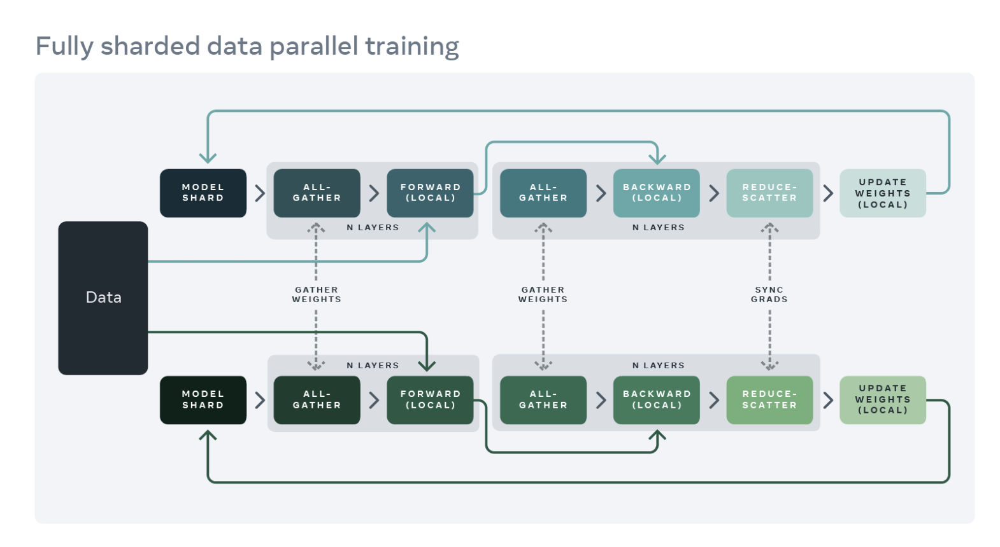

Fully Sharded Data Parallel (FSDP) is a distributed training algorithm that partitions both the dataset and model parameters across devices. FSDP can be classified as a data parallel algorithm since each device performs the computation on its local subset of the training data for each micro-batch

							Fig 1: FSDP Workflow. (Image [Source](https://engineering.fb.com/2021/07/15/open-source/fsdp/))

The workflow of FSDP is as follows:
1. Each device is responsible for a shard of the model parameters and receives a micro-batch of data for training.
2. Before the forward pass, FSDP performs an `All-Gather` operation on each device and releases the model weights that are not part of its assigned shard. This allows each device to store only the weights it needs, resulting in improved performance.
3. Another `All-Gather` operation is performed before the backward pass.
4. After backpropagation, each device has access to the gradients for all parameters for its micro-batch of data. Each device then receives gradients from other devices for its assigned shard of model parameters and discards gradients that are not part of its shard. This process is known as the `Reduce-Scatter` operation.
5. Local weight updates are performed next.

Compared to traditional Model Parallelism, FSDP has a reduced communication overhead since there is no need to communicate intermediate activations between devices. However, when dealing with very large models or datasets, there is still a considerable amount of communication overhead that needs to be managed. This is due to the need to synchronize gradients across devices during the `All-Gather` and `Reduce-Scatter` operations.

